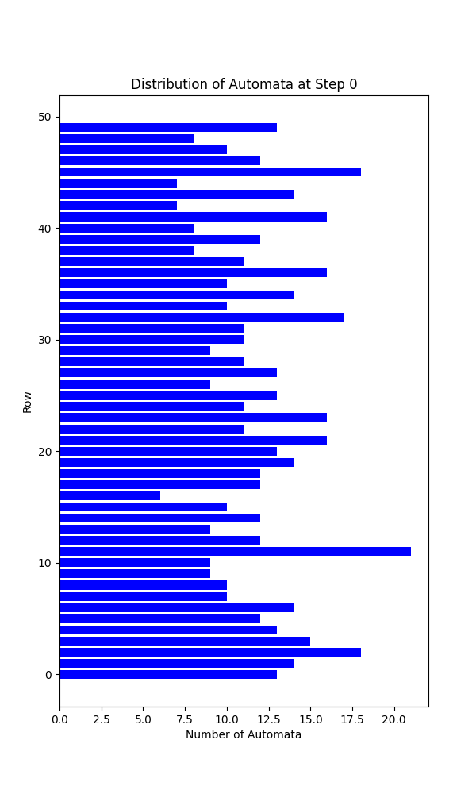
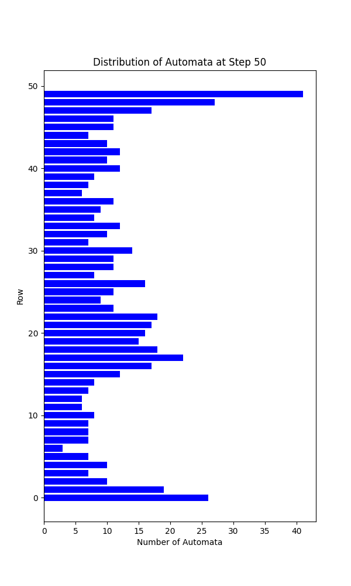
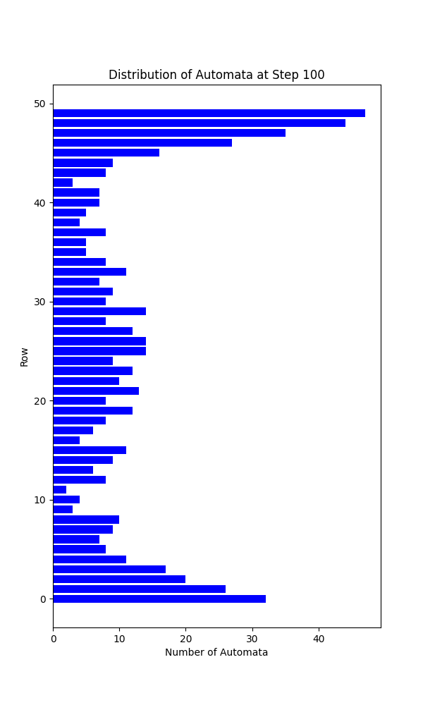
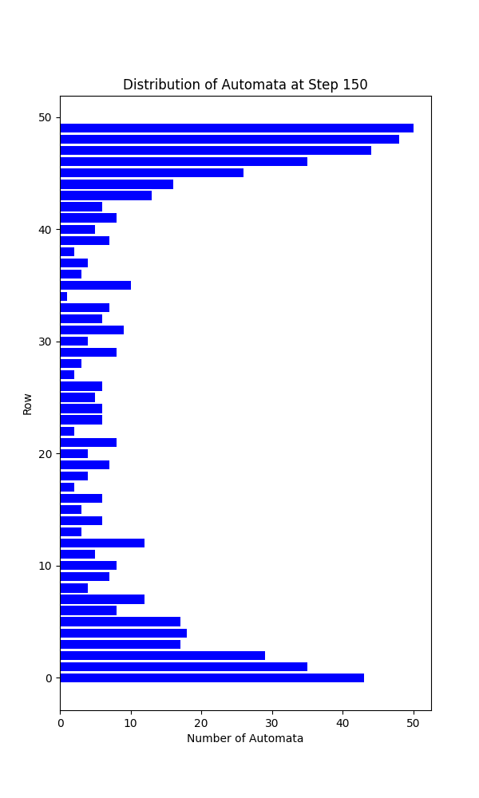
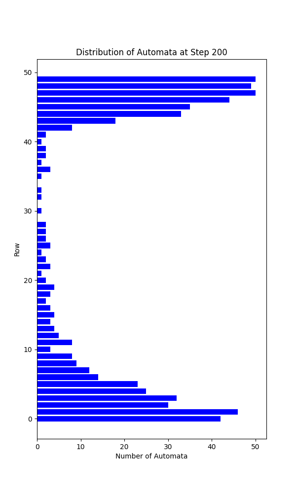
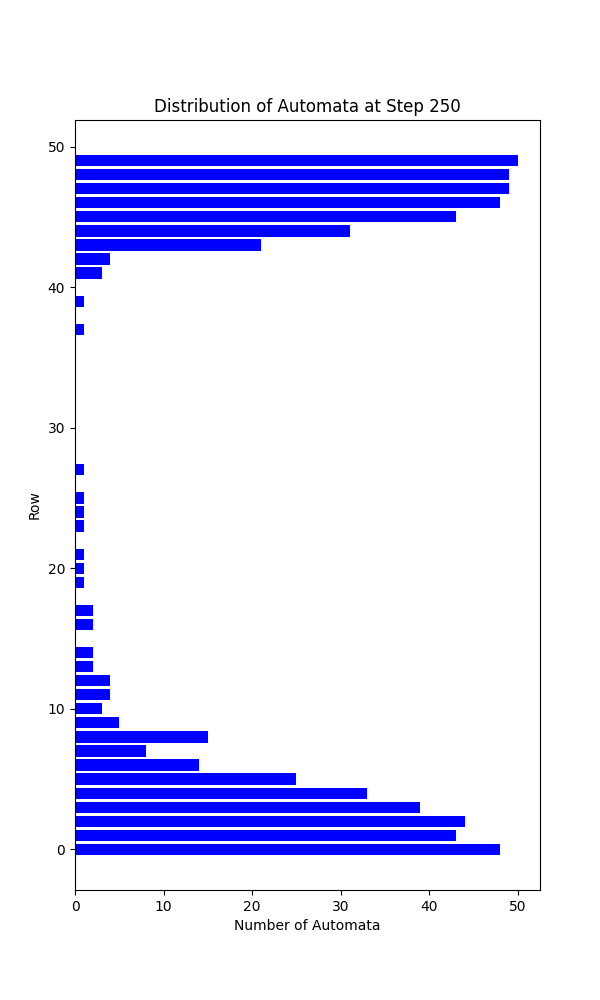
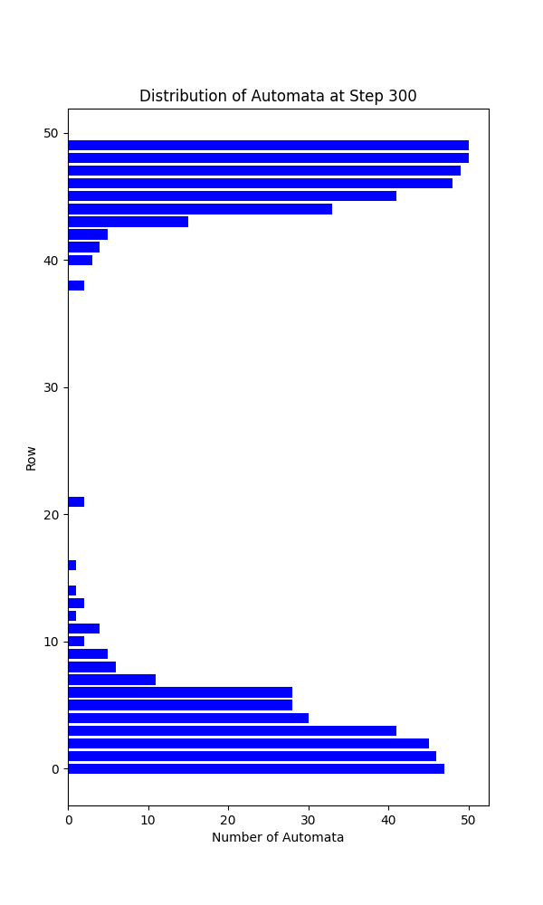

# Informe: Modelado de Decantación utilizando Autómatas Celulares

## Introducción

La decantación es un proceso físico donde partículas de diferentes densidades se separan por acción de la gravedad. Esta simulación busca replicar este fenómeno en un entorno simplificado, mostrando cómo las partículas se distribuyen en función de sus reglas de movimiento y la dinámica del sistema.

El objetivo de este proyecto fue utilizar autómatas celulares para modelar un proceso de decantación, simulando partículas que se mueven en una matriz bidimensional con comportamientos específicos. Los autómatas celulares son modelos computacionales que consisten en celdas que evolucionan en pasos discretos siguiendo reglas locales. En este caso, el modelo se utilizó para representar partículas de dos tipos (`AutomatonA` y `AutomatonB`) con diferentes sesgos en sus movimientos, simulando un proceso de separación basado en sus características.

---

## Código y Elección de Parámetros

El programa implementa dos clases de autómatas: `AutomatonA` y `AutomatonB`, que se usan para poblar la matriz y simular la posición actual de cada automáta en cada paso.
En cada paso se intenta mover cada uno de los autómatas, siguiendo las siguientes reglas:
- Si la celda a la que se pretende mover el autómata esta ocupada, se omite el movimiento
- Si intenta moverse a una celda por fuera de las fronteras superiores o inferiores, se omite el movimiento
- Si intenta moverse a una celda por fuera de los fronteras laterales, se determina la nueva posición con una frontera periódica

En un punto del desarrolló, se consideró implementar una restricción que impidiera mover a los autómatas una vez llegaran a una frontera superior, pero se prefirió dejarlos mover libremente para ilustrar el hecho de que de todas formas tienden hacia arriba o hacia abajo.


Para elegir la dirección en la que se mueve cada autómata, se define un arreglo de los posibles movimiento, donde cada movimiento esta definido de la siguiente manera:

```python
UP = (-1, 0)
DOWN = (1, 0)
LEFT = (0, -1)
RIGHT = (0, 1)
```

El `AutomatonA` tiene tendencia a moverse hacia abajo, y su arreglo de posibles movimiento es

```python
directions = [DOWN, DOWN, DOWN, UP, LEFT, RIGHT]
```

El `AutomatonB` tiene tendencia a moverse hacia arriba, y su arreglo de posibles movimiento es

```python
directions = [UP, UP, DOWN, LEFT, RIGHT]
```

Para elegir el posible movimiento del autómata entonces, se elige uno de los movimientos entre sus posibilidades aleatoriamente

```python
def get_direction(self):
    return random.choice(self.directions)
```

De esta forma, el `AutomatonA` tiene 50% probabilidad de moverse hacia abajo y 16% de probabilidad de moverse en cualquier otra dirección.
Por otro lado, el `AutomatonB` tiene 40% probabilidad de moverse hacia arriba y 20% de probabilidad de moverse en otra dirección.

Estos valores se eligieron luego de probar varias otras probabilidades, pero estas son suficientemente altas para que en apróximadamente 300 pasos, el proceso de decantación ya haya terminado. Si se quisiera modificar estos parámetros, se pueden hacer facilmente en las líneas  36 y 49 para el `AutomatonA` y `AutomatonB` respectivamente.

Por último, se eligieron crear 300 autómatas de cada tipo, y simular 300 pasos. Se encontró que luego de este número de pasos con este número de autómatas los resultados no cambian significativamente.
Estos parámetros son fácilmente modificables en las líneas 216 y 217 del código.

---

## Resultados

Los resultados de la simulación se analizaron mediante histogramas que muestran la distribución de autómatas en las filas de la matriz en momentos específicos. Siempre se generan al menos 2 histogramas, el histograma con la distribución inicial de los autómatas, y el histograma con la distribución final, estos, se guardarán en `automatas/simulation_<date>`.

Adicionalmente, con la variable `number_of_graphs` se puede especificar cuántos histogramas adicionales se quieren, y estos representarán el estado de la matriz de ocupación en pasos distribuidos equidistantemente. Por ejemplo, si se realiza la simulación para 300 pasos, y se especifican 6 histogramas, se generarán histogramas de el estado de la matriz en los pasos 50, 100, 150, 200, 250 y 300. 

Los siguientes histogramas, se obtuvieron de correr la simulación con los siguientes parámetros:

```python
number_of_automaton = 300
steps = 300
number_of_graphs = 6
```

### Distribución inicial

<div align="center">
    
</div>

### Distribución en el paso 50

<div align="center">
    
</div>

### Distribución en el paso 100

<div align="center">
    
</div>

### Distribución en el paso 150

<div align="center">
    
</div>

### Distribución en el paso 200

<div align="center">
    
</div>

### Distribución en el paso 250

<div align="center">
    
</div>

### Distribución en el paso final

<div align="center">
    
</div>


---

## Conclusión


Los histogramas confirman que los autómatas se agrupan de acuerdo a sus reglas de movimiento, lo que simula el proceso de separación esperado. Las gráficas muestran cómo la interacción de reglas locales puede producir comportamientos globales coherentes con los fenómenos físicos que se intentan modelar.

Este modelo simple de autómatas celulares demostró ser una herramienta efectiva para simular procesos físicos como la decantación. Aunque es una representación abstracta y simplificada, ofrece una base sólida para explorar fenómenos más complejos, incluyendo interacciones entre partículas o la influencia de fuerzas externas.


# Referencias

**Programa Editorial Universidad del Valle.** *Ciencias de la computación: Material académico*, de [https://libros.univalle.edu.co/index.php/programaeditorial/catalog/download/150/72/1361?inline=1](https://libros.univalle.edu.co/index.php/programaeditorial/catalog/download/150/72/1361?inline=1)

**Sim, J. C. A.** *An introduction to Cellular Automata*. de [https://www.jcasim.de/main/node6.html](https://www.jcasim.de/main/node6.html)

